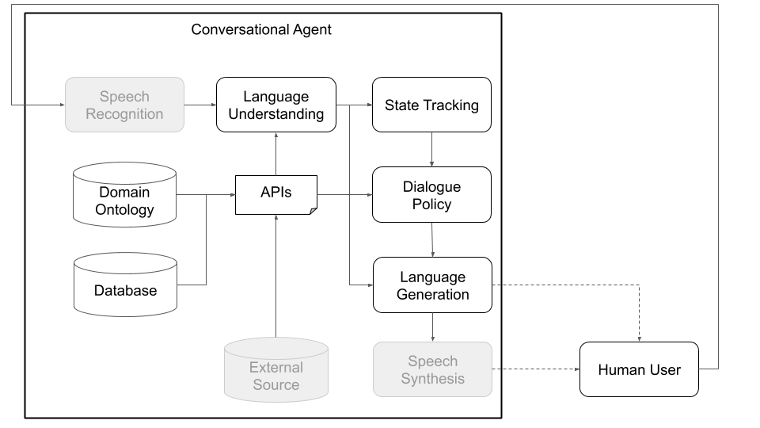
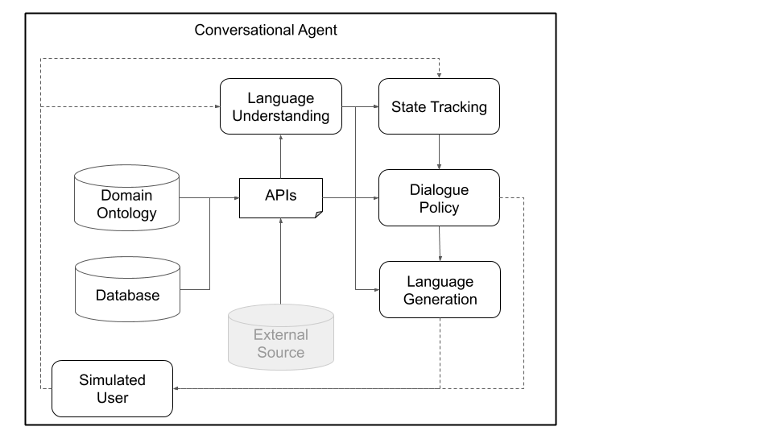
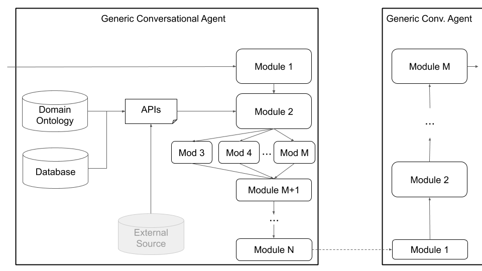

# Plato Research Dialogue System

This is a v 0.1 release.

The Plato Research Dialogue System is a flexible framework that can be used to 
create, train, and evaluate conversational AI agents in various environments. 
It supports interactions through speech, text, or dialogue acts and each 
conversational agent can interact with data, human users, or other 
conversational agents (in a multi-agent setting). Every component of every 
agent can be trained independently online or offline and Plato provides an 
easy way of wrapping around virtually any existing model, as long as Plato's 
interface is adhered to. 

Publication citations:

Alexandros Papangelis, Yi-Chia Wang, Piero Molino, and Gokhan Tur, 
“Collaborative Multi-Agent Dialogue Model Training Via Reinforcement Learning”, 
SIGDIAL 2019

Alexandros Papangelis, Yi-Chia Wang, Mahdi Namazifar, Chandra Khatri, Piero 
Molino, and Gokhan Tur, "Plato Research Dialogue System: A Flexible 
Conversational AI Research Platform", ArXiv (to appear)

# How does the Plato Research Dialogue System work?
Conceptually, a conversational agent needs to go through various steps in order to process information it receives as input (e.g., “What’s the weather like today?”) and produce an appropriate output (“Windy but not too cold.”). The primary steps, which correspond to the main components of a standard architecture (see Figure 1), are: 

* Speech recognition (transcribe speech to text)
* Language understanding (extract meaning from that text)
* State tracking (aggregate information about what has been said and done so far)
* API call (search a database, query an API, etc.)
* Dialogue policy (generate abstract meaning of agent’s response)
* Language generation (convert abstract meaning into text)
* Speech synthesis (convert text into speech)

Plato has been designed to be as modular and flexible as possible; it supports 
traditional as well as custom conversational AI architectures, and importantly,
enables multi-party interactions where multiple agents, potentially with 
different roles, can interact with each other, train concurrently, and solve 
distributed problems. 

Figures 1 and 2, below, depict example Plato conversational agent architectures
when interacting with human users and with simulated users. Interacting with 
[simulated users](https://pdfs.semanticscholar.org/5024/e0685f5ac8328129c5a4ae57f58109317063.pdf) 
is  a common practice used in the research community to 
jump-start learning (i.e., learn some basic behaviours before interacting 
with humans). Each individual component can be trained online or offline 
using any machine learning library (for instance, [Ludwig](https://uber.github.io/ludwig),
[TensorFlow](https://www.tensorflow.org/), [PyTorch](https://pytorch.org/), 
your own implementations) as Plato is a universal framework. Ludwig, Uber's open source deep 
learning toolbox, makes for a good choice, as it does not require writing 
code and is fully compatible with Plato. 

Figure 1: Plato's modular architecture means that any component can be trained 
online or offline and can be replaced by custom or pre-trained models. 
(Grayed components in this diagram are not core Plato components.)

 
Figure 2: Using a simulated user rather than a human user, as in Figure 1, we 
can pre-train statistical models for Plato's various components. These can then
be used to create a prototype conversational agent that can interact with human
users to collect more natural data that can be subsequently used to train 
better statistical models. (Grayed components in this diagram are not Plato 
core components.)

In addition to single-agent interactions, Plato supports multi-agent 
conversations where multiple Plato agents can interact with and learn from each
other. Specifically, Plato will spawn the conversational agents, make sure that
 inputs and outputs (what each agent hears and says) are passed to each agent 
 appropriately, and keep track of the conversation.

This setup can facilitate research in multi-agent learning, where agents need 
to learn how to generate language in order to perform a task, as well as 
research in sub-fields of multi-party interactions (dialogue state tracking, 
turn taking, etc.). The dialogue principles define what each agent can 
understand (an ontology of entities or meanings; for example: price, location, 
preferences, cuisine types, etc.) and what it can do (ask for more information,
provide some information, call an API, etc.). The agents can communicate over 
speech, text, or structured information (dialogue acts) and each agent has its 
own configuration. Figure 3, below, depicts this architecture, outlining the 
communication between two agents and the various components:

Figure 3: Plato's architecture allows concurrent training of multiple agents, 
each with potentially different roles and objectives, and can facilitate 
research in fields such as multi-party interactions and multi-agent learning. 
(Grayed components in this diagram are not core Plato components.)  

Finally, Plato supports custom architectures (e.g. splitting NLU into multiple 
independent components) and jointly-trained components (e.g. text-to-dialogue 
state, text-to-text, or any other combination) via the generic agent 
architecture shown in Figure 4, below. This mode moves away from the standard 
conversational agent architecture and supports any kind of architecture 
(e.g., with joint components, text-to-text or speech-to-speech components, or 
any other set-up) and allows loading existing or pre-trained models into Plato.

Figure 4: The most abstract version of a Plato agent (referred to as generic 
agent).  

Users can define their own architecture and/or plug their own components into 
Plato by simply providing a Python class name and package path to that module, 
as well as the model’s initialization arguments. All the user needs do is list 
the modules in the order they should be executed and Plato takes care of the 
rest, including wrapping the input/output, chaining the modules, and handling 
the dialogues. Plato supports serial and parallel execution of modules.

Plato also provides support for Bayesian optimization of conversational AI 
architectures or individual module parameters through Bayesian Optimisation of 
Combinatorial Structures (BOCS). 